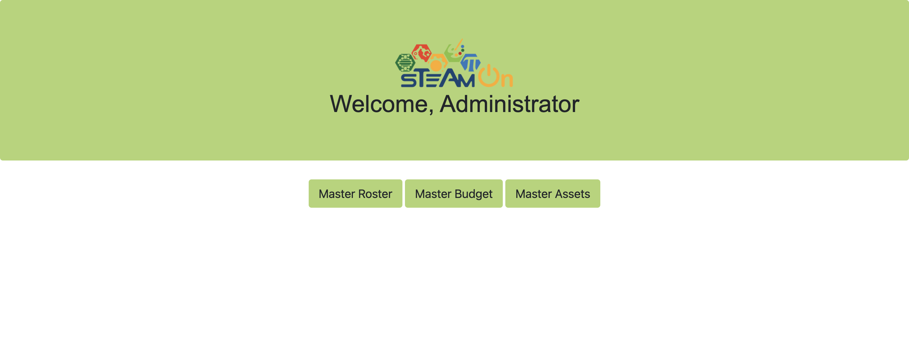
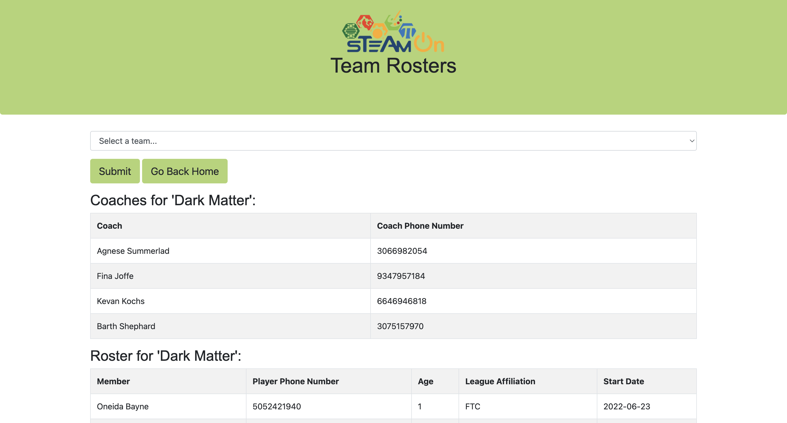
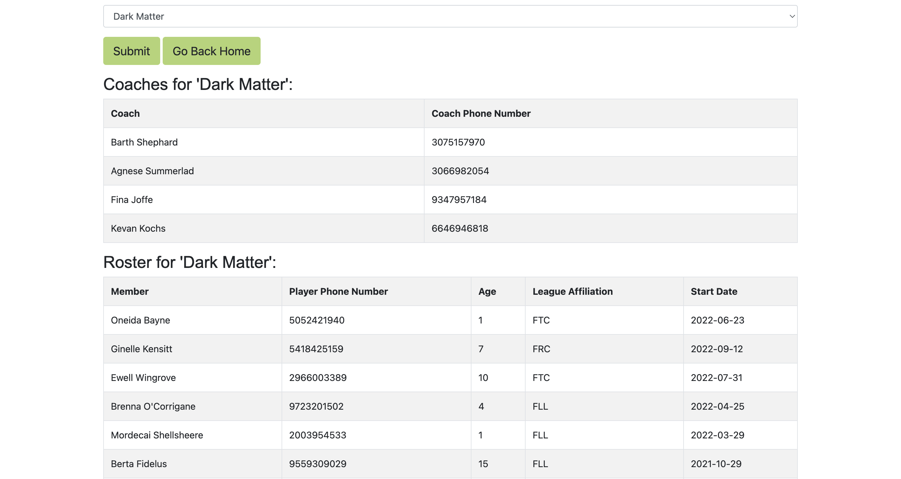

## Overview
This is a project that I developed for a group project in a college databases course. We used SQL, PHP, HTML, and CSS in this project. We worked with a STEAM-focused robotics non-profit that nurtures kids aged 8-18 in their technology related interests.

## Walkthrough

This is the landing page for an administrator user with navigation buttons.

Here, the user can select for what team they wish to see the coaches and members.
Note: This is randomly generated data.

This shows the coaches and teams for the selected team in two separate tables.
